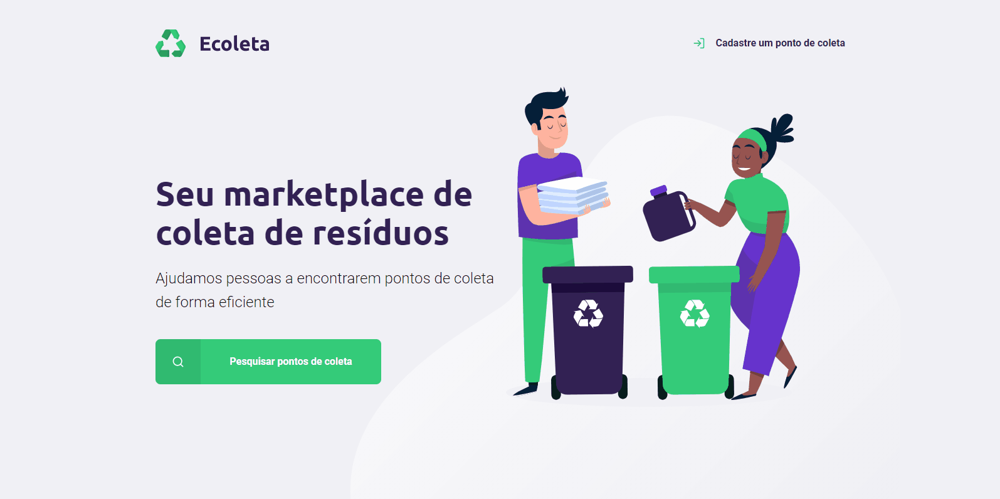

# Ecoleta

Projeto desenvolvido durante a Next Level Week - Starter - da @RocketSeat.

A ideia é criar uma aplicação onde instituições podem cadastrar pontos de coleta e itens de coleta para reciclagem e os usuários podem procurar esses pontos por cidades.

## Como usar

Instale as dependências e inicie a aplicação

```bash
npm install
npm start
```

## Demonstração




## Como contribuir

Faça um Fork desse repositório,

Crie uma branch com a sua modificação : git checkout -b my-feature

Commit suas mudanças: git commit -m 'feat: My new feature'

Push a sua branch: git push origin my-feature

## License
[MIT](https://choosealicense.com/licenses/mit/)
